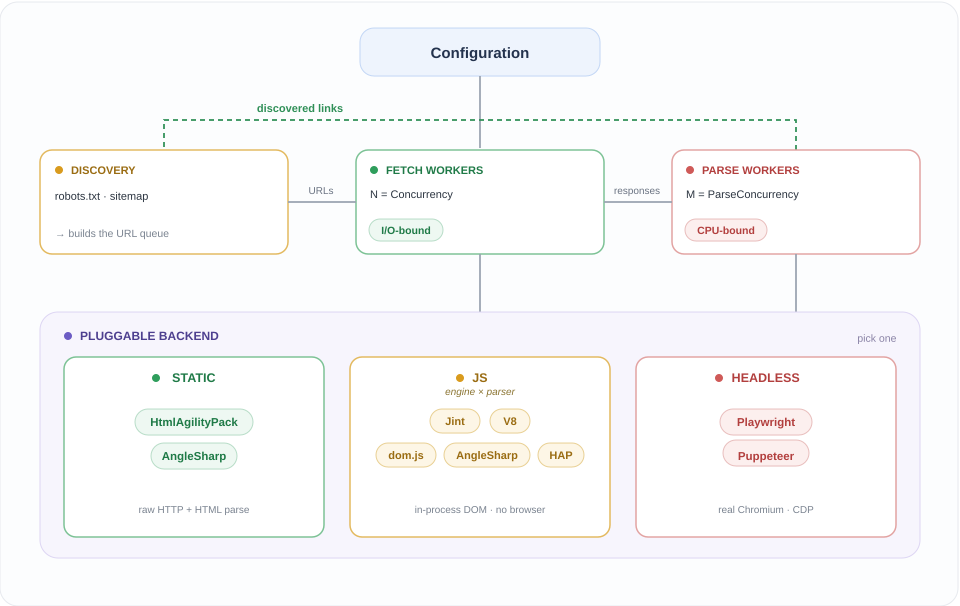

# Configuration

This section describes configuration in detail, when running the CLI isn't enough.

- [`CrawlerOptions`](./crawler-options.md): shared options.
- [JavaScript crawlers](./javascript-crawlers.md): Jint vs V8, HTML parsers, `JsRenderOptions`.
- [Performance](./performance.md): comparison of crawler performance.

## Pipeline

`Crawler.Core` is a two-stage fetch → parse pipeline. A backend only implements
`LoadResponse()` (load a page) and `ExtractPageData()` (extract links); everything else is shared. Swapping backend is one DI call.

<p align="center">
  <picture>
    <source media="(prefers-color-scheme: dark)" srcset="./pipeline-dark.svg">
    
  </picture>
</p>

## Tiers

Trade fidelity for cost. Start at the cheapest tier that returns the links you need.

| Tier         | Runs JS | Browser | Cost\* | Use when                                                |
| ------------ | ------- | ------- | ------ | ------------------------------------------------------- |
| **Static**   | no      | no      | 1×     | links are in the server HTML (SSR, MPA, classic CMS)    |
| **JS**       | yes     | no      | ~5–30× | client-only SPA builds links at runtime, standard APIs  |
| **Headless** | yes     | yes     | ~50–100× | needs a real browser (RSC streaming, canvas, workers) |

\* Per-page, relative to a static parse. Measured numbers found under [performance](./performance.md).

**Static** (`HtmlAgilityPack`, `AngleSharp`) crawlers do one HTTP request, then a HTML parse, they run no scripts and miss anything injected by client JS.

**JS** (`Crawler.Js`) crawlers fetches the shell, builds an in-process DOM (`dom.js`), runs scripts in Jint or V8, extracts links. Renders real markup without a browser. Two-part
choice (engine + parser): [JS tier](./js-tier.md).

**Headless** (`Playwright`, `Puppeteer`) crawlers run a real browser with everything in it. This is for sites that use advanced features like: RSC streaming, service workers, canvas/WebGL that the JavaScript crawlers don't support.

## Wiring

Shared options object (see [CrawlerOptions](./crawler-options.md)):

```csharp
var options = new CrawlerOptions
{
    Concurrency = 16,
    ParseConcurrency = 8,
    MaxPages = 5000,
    UserAgent = "my-crawler/1.0",
};
```

### Static

```csharp
using Crawler.HtmlAgilityPack;       // or Crawler.AngleSharp

var services = new ServiceCollection();
services.AddHtmlAgilityPackCrawler(options, (provider, client) =>
    client.DefaultRequestHeaders.Add("Cookie", "session=..."));   // optional HttpClient hook

var crawler = services.BuildServiceProvider().GetRequiredService<DefaultHtmlAgilityPackCrawler>();
var result = await crawler.Start("https://example.com/");         // result.Urls = discovered set
```


### JS (engine + parser)

Register one engine and at most one `IHtmlParser` (if no parser is configured `dom.js`'s own tokenizer is used).

```csharp
using Crawler.Js.V8;                 // engine: or Crawler.Js.Jint
using Crawler.Js.HtmlAgilityPack;    // parser: or Crawler.Js.AngleSharp, or omit

var renderOptions = new JsRenderOptions { EnableFetch = true };

var services = new ServiceCollection();
services.AddV8Crawler(options, renderOptions);
services.AddHtmlAgilityPackHtmlParser();

var crawler = services.BuildServiceProvider().GetRequiredService<DefaultV8Crawler>();
var result = await crawler.Start("https://example.com/");
```

### Headless

```csharp
using Crawler.Playwright;            // or Crawler.Puppeteer

var services = new ServiceCollection();
services.AddPlaywrightCrawler(options);   // no HttpClient hook; configure via browser context

var crawler = services.BuildServiceProvider().GetRequiredService<DefaultPlaywrightCrawler>();
var result = await crawler.Start("https://example.com/");
```
